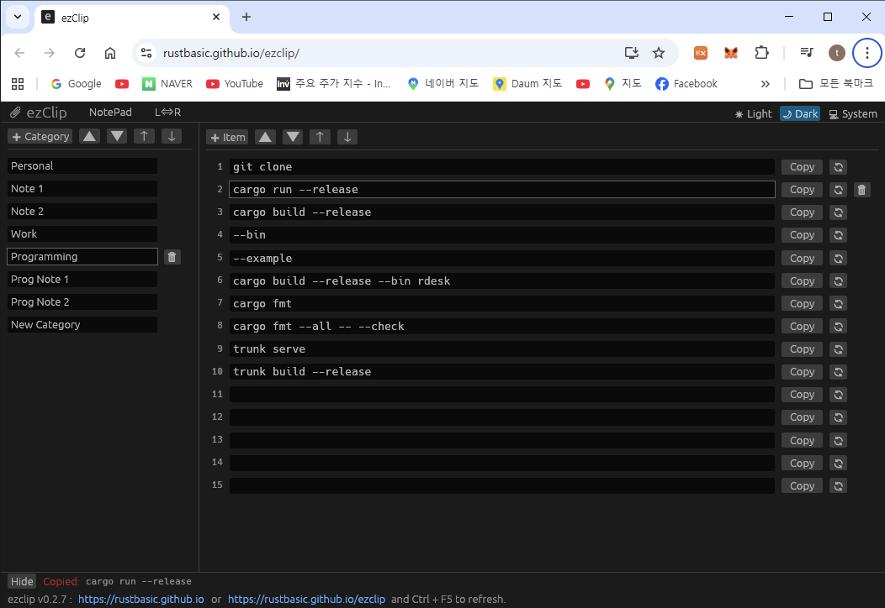

# 📎 ezClip: Effortless Snippet & Clipboard Manager

| Status | Primary Link | Mirror Link |
| :---: | :---: | :---: |
| **Stable** | [https://rustbasic.github.io](https://rustbasic.github.io) | [https://rustbasic.github.io/ezclip](https://rustbasic.github.io/ezclip) | 

---

## 🚀 Overview

**ezClip** is a high-performance, lightweight text snippet manager built with **Rust** and **egui**. It is designed to help you organize and access your most frequently used code blocks, templates, and text fragments with ease. Whether you are on Desktop or Web (WASM), ezClip ensures your productivity never skips a beat.

## ✨ Key Features

*   **📂 Category-Based Organization:** Group your snippets into custom categories like "Work," "Personal," or "API Templates."
*   **💾 Smart Persistence:** No "Save" button required! Your data is automatically serialized and restored every time you launch the app.
*   **⚡ Instant Copying:** Copy any item to your clipboard instantly by clicking the 'Copy' button or simply **double-clicking** the text field.
*   **📝 Advanced Notepad Mode:** View and edit all snippets in a category as a single text block. 
    *   *Special Logic:* In Notepad Mode, **double-clicking any line** will automatically copy that entire line to your clipboard!
*   **🔄 Flexible Layout:** Toggle the side panel between **Left** and **Right** with the `L⇔R` button to match your workspace preference.
*   **🦀 Rust Powered:** Enjoy the memory safety and speed of Rust, with full support for UTF-8 characters (including Korean, Emojis, etc.).
*   **🔍 Clipboard Monitor (Desktop):** Keep track of your system clipboard history in real-time through the bottom panel.

## 🛠 Built With

*   **Rust**: For performance and reliability.
*   **eframe/egui**: For a smooth, immediate-mode GUI experience across platforms.
*   **Serde**: For robust data serialization.

## 💡 How to Use

1.  **Launch:** Open the [ezClip Web Version](https://rustbasic.github.io) or run the native desktop executable.
2.  **Manage Categories:** Use the side panel to add (`➕ Category`), rename, or rearrange your folders.
3.  **Manage Items:** Add new snippets in the central panel using the `➕ Item` button.
4.  **Copy Quickly:** Double-click any text field in standard mode, or double-click a line in **NotePad Mode** to copy it instantly.
5.  **Bulk Edit:** Use **NotePad Mode** to edit all items at once. Switching back will automatically split the lines back into individual items.
